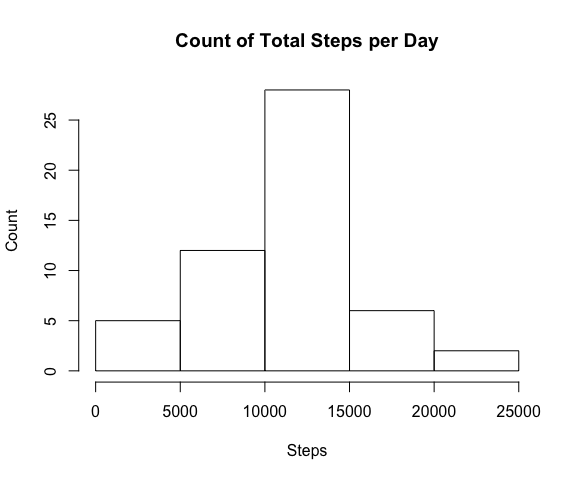
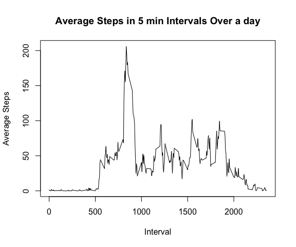
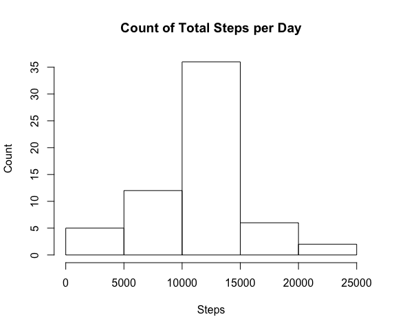
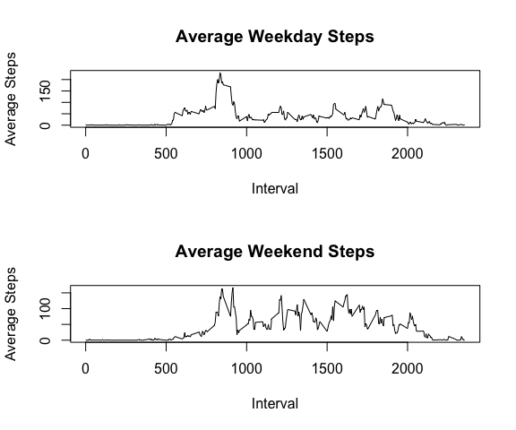

## Loading and preprocessing the data
The data is stored in the working directory and will be loaded below and assigned to the name *data*.


```r
data<-read.csv("activity.csv", header = TRUE, stringsAsFactors = FALSE)
data$date<-as.Date(data$date)
```


## What is mean total number of steps taken per day?
In this part of the assignment, the missing values are ignored.  The first step is to look at the mean number of steps per day.  This is done below.

```r
onoff<-is.na(data$steps)
stepsPerDay<-aggregate(data$steps[!onoff], by=list(data$date[!onoff]), FUN=sum)
names(stepsPerDay)<-c("Date","Steps")
```
Next, we will take that data and make a histogram

```r
hist(stepsPerDay$Steps, xlab = "Steps", main = "Count of Total Steps per Day", ylab = "Count")
```

<!-- -->
  
Next we will simply report the mean and median of the total steps for each day.

```r
paste("The mean steps per day is:",as.character(round(mean(stepsPerDay$Steps))))
```

```
## [1] "The mean steps per day is: 10766"
```

```r
paste("The median steps per day is:",as.character(median(stepsPerDay$Steps)))
```

```
## [1] "The median steps per day is: 10765"
```


## What is the average daily activity pattern?
We can start this section by organizing the data by the interval in a similar way to how it was done by date.  This time we will look at the mean rather than the sum.  

```r
onoff<-is.na(data$steps)
stepsPerInterval<-aggregate(data$steps[!onoff], by=list(data$interval[!onoff]), FUN=mean)
names(stepsPerInterval)<-c("Interval","Steps")
```
Here we can now create a time series plot to look at the average daily activity.

```r
plot(stepsPerInterval$Interval,stepsPerInterval$Steps, type = "l", xlab = "Interval", ylab = "Average Steps",main = "Average Steps in 5 min Intervals Over a day")
```

<!-- -->
  
Next, we want to see which interval the maximum steps are taken.


```r
paste("The interval witht he maximum average steps is:",as.character(stepsPerInterval$Interval[which.max(stepsPerInterval$Steps)]))
```

```
## [1] "The interval witht he maximum average steps is: 835"
```


## Imputing missing values
First thing we will do here is report the number of rows with an NA in them.

```r
naRows <- sum(rowSums(is.na(data)) > 0)
```
There are 2304 rows with an NA in them.  

Next we want to replace these values. The method that will be used is replacing it with the mean for that interval.  This is saved into a new data set titled "ModifiedData.csv"

```r
for (i in 1:length(data$steps)){
        if (is.na(data$steps[i]) == TRUE){
                data$steps[i]<-stepsPerInterval$Steps[match(data$interval[i],stepsPerInterval$Interval)]
        }
}
write.csv(data,"ModifiedData.csv", row.names = FALSE)
```

Next we are going to repeat the number of steps per data and compare that to the original numbers.

```r
stepsPerDayMod<-aggregate(data$steps, by=list(data$date), FUN=sum)
names(stepsPerDayMod)<-c("Date","Steps")
```


```r
hist(stepsPerDayMod$Steps, xlab = "Steps", main = "Count of Total Steps per Day", ylab = "Count")
```

<!-- -->

Now let's comare these new nubmers to the originals.  The mean is now 10766.19 compared to 10766.19.  
The median is now 10766.19 compared to 10765.  We can see that the mean didn't change.  The median however did change.  It also became a non-interger value because we replaced some numbers with means.


## Are there differences in activity patterns between weekdays and weekends?
We want to see if there are differences between weekdays and weekend activity.  To do this, we will first add a new variable saying whether or not it is a weekend or weekday.


```r
library(timeDate)
TFweekday<-isWeekday(data$date)
data$weekday<-ifelse(TFweekday == TRUE, "weekday","weekend")
```

Next, we want to simply create two new interval averages, one for weekdays and one one for weekends.


```r
onoff<-ifelse(data$weekday == "weekday",TRUE,FALSE)
weekendSteps<-aggregate(data$steps[!onoff], by=list(data$interval[!onoff]), FUN=mean)
names(weekendSteps)<-c("Interval","Steps")
weekdaySteps<-aggregate(data$steps[onoff], by=list(data$interval[onoff]), FUN=mean)
names(weekdaySteps)<-c("Interval","Steps")
```

Finally, we are going to compare these two in a time series.

```r
par(mfrow=c(2,1))
plot(weekdaySteps$Interval,weekdaySteps$Steps, type = "l", xlab = "Interval", ylab = "Average Steps",main = "Average Weekday Steps")
plot(weekendSteps$Interval,weekendSteps$Steps, type = "l", xlab = "Interval", ylab = "Average Steps",main = "Average Weekend Steps")
```

<!-- -->
